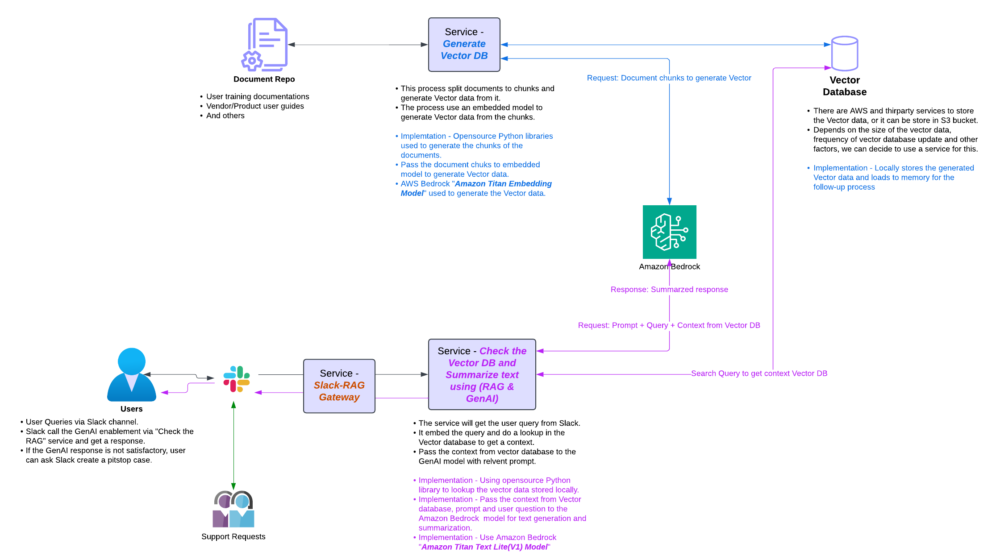

## A Description
This architecture demonstrates a modern customer service solution that leverages open-source tools and AI models to build a powerful knowledge retrieval system. Here's how it works:
The knowledge base creation pipeline starts with a Document Repository containing organizational documentation, user guides, and other materials. The Vector Generation service processes these documents using:

PyPDF and other document parsers to extract text from various file formats
LangChain's text splitters to chunk documents into manageable segments
Open-source embedding models to convert text chunks into vector representations
FAISS-CPU for efficient vector storage and similarity search capabilities

For the user interaction flow through Slack:

Users submit queries via Slack channel
The Slack-RAG Gateway service receives these queries
LangChain's retrieval modules search the FAISS vector store to find relevant document chunks
Retrieved context is combined with the user query using LangChain's prompt templates
The combined prompt is sent to Amazon Bedrock for generating the final response

## What is RAG

RAG (Retrieval-Augmented Generation) is a machine learning framework that enhances the performance of generative models by combining them with information retrieval techniques. This approach allows a language model to generate more accurate, context-aware, and factual responses by retrieving relevant information from custom CBS documentation, vendor user training documents, etc.

---

## Key Services

Below are the key services identified in this architecture:

### Generate Vector Database

This service splits the input documents into several chunks and passes these document chunks to an embedding model, which generates vector data.

### Text Generation and Summarization using RAG

The input to this service is the user's question or query. The service performs a lookup of the query in the vector database to create relevant context. It then formulates a prompt that includes both the context from the vector database and the user's query, which is passed to a generative AI model to generate and summarize text.

### RAG-Slack Gateway

This service acts as a bridge between the current user support tools available in the Slack channel and the RAG service.

---

## POC (Proof of Concept)

Implemented Python services for the following:

### Generate Vector Database

- This script processes PDF files by splitting their content into chunks, generating text embeddings using Amazon Bedrock's text embedding model, and saving them in a vector store for efficient retrieval.
  - **Steps:**
    - Split the documents into multiple chunks.
    - Generate the vector data via Amazon Bedrock using the Amazon Titan Embedding Model.
    - Use the FAISS (open-source) library to store the vector database locally.

### Text Generation and Summarization using RAG

- This process handles user queries by embedding them, retrieving relevant context from a locally stored vector database, and using Amazon Bedrock for text generation and summarization. It combines open-source Python libraries for vector database lookups and Amazon Bedrock for advanced AI capabilities.
  - **Steps:**
    - Get user query and embed it.
    - Perform a lookup in the locally stored vector database to extract relevant context.
    - Combine the retrieved context, user query, and a relevant prompt for text generation.
    - Use the Amazon Bedrock Amazon Titan Text Lite (V1) Model to generate and summarize text.

